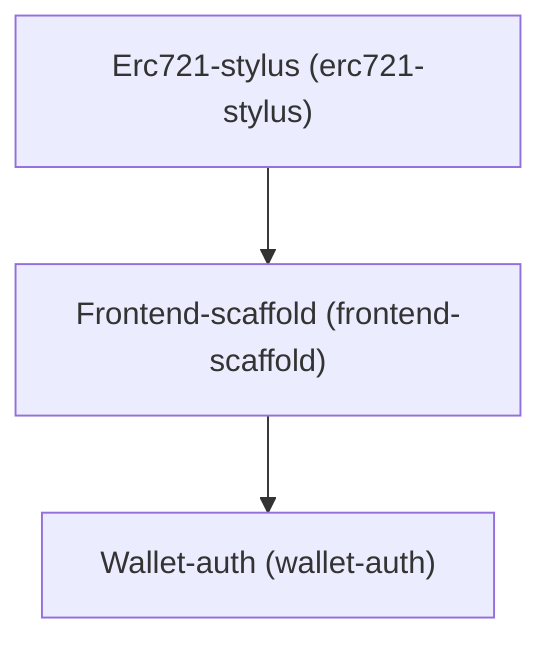

# Architecture

## Dependency Graph

```mermaid
graph TD
  32187477["Erc721-stylus (erc721-stylus)"]
  4287f26d["Frontend-scaffold (frontend-scaffold)"]
  08152a86["Wallet-auth (wallet-auth)"]
  32187477 --> 4287f26d
  4287f26d --> 08152a86
```

## Execution / Implementation Order

1. **Erc721-stylus** (`32187477`)
2. **Frontend-scaffold** (`4287f26d`)
3. **Wallet-auth** (`08152a86`)
