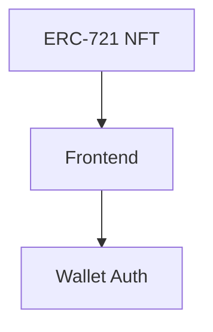

# My App

> A Web3 application composed with [N]skills.

**Network**: Arbitrum Sepolia (Chain ID: 421614) — Testnet
**Keywords**: 

---

## Architecture

## Components

| Component | Type | Category | User Prompt |
|-----------|------|----------|-------------|
| ERC-721 NFT | `erc721-stylus` | contracts | (none) |
| Frontend | `frontend-scaffold` | app | (none) |
| Wallet Auth | `wallet-auth` | app | (none) |

## Implementation Order

Build the project in this order (respects dependencies):

1. **ERC-721 NFT** (`erc721-stylus`) — see `.nskills/components/erc721-stylus--32187477.md`
2. **Frontend** (`frontend-scaffold`) — see `.nskills/components/frontend-scaffold--4287f26d.md`
3. **Wallet Auth** (`wallet-auth`) — see `.nskills/components/wallet-auth--08152a86.md`

## Environment Variables

| Key | Description | Required | Default |
|-----|-------------|----------|---------|
| `NEXT_PUBLIC_NFT_ADDRESS` | Deployed ERC721 NFT address | No |  |
| `ERC721_DEPLOYMENT_API_URL` | URL of the ERC721 deployment API | No | http://localhost:4001 |
| `NEXT_PUBLIC_WALLETCONNECT_PROJECT_ID` | WalletConnect Cloud project ID for wallet connections | Yes |  |
| `NEXT_PUBLIC_APP_NAME` | Application name displayed in wallet dialogs | No | My DApp |

## Key Dependencies

| Package | Version |
|---------|---------|
| `next` | `^14.2.0` |
| `react` | `^18.3.0` |
| `react-dom` | `^18.3.0` |
| `wagmi` | `^2.12.0` |
| `viem` | `^2.21.0` |
| `@tanstack/react-query` | `^5.51.0` |
| `@rainbow-me/rainbowkit` | `^2.1.0` |
| `clsx` | `^2.1.0` |
| `tailwind-merge` | `^2.2.0` |
| `ethers` | `^6.13.0` |
| `lucide-react` | `^0.400.0` |
| `@radix-ui/react-select` | `^2.0.0` |
| `@types/node` | `^20.0.0` |
| `@types/react` | `^18.3.0` |
| `@types/react-dom` | `^18.3.0` |
| `typescript` | `^5.4.0` |
| `eslint` | `^8.57.0` |
| `eslint-config-next` | `^14.2.0` |
| `tailwindcss` | `^3.4.0` |
| `postcss` | `^8.4.0` |
| `autoprefixer` | `^10.4.0` |

## Detailed Component Specs

- [ERC-721 NFT](.nskills/components/erc721-stylus--32187477.md)
- [Frontend](.nskills/components/frontend-scaffold--4287f26d.md)
- [Wallet Auth](.nskills/components/wallet-auth--08152a86.md)

## Additional Context

- [Project Configuration](.nskills/project.md)
- [Full Architecture Details](.nskills/architecture.md)
- [All Environment Variables](.nskills/environment.md)
- [Verified Dependencies](.nskills/dependencies.md)
- [Scripts Reference](.nskills/scripts.md)
- [Integration Map](.nskills/integration-map.md)

---

*Generated by [[N]skills](https://www.nskills.xyz) — Compose N skills for your Web3 project.*
